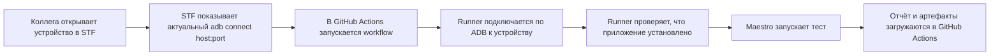
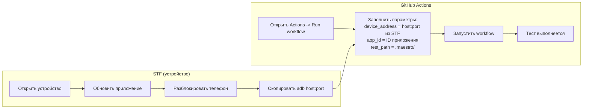

# Maestro + STF

Этот репозиторий запускает автотест `Maestro` на реальном Android-устройстве, которое подключено к STF-ферме и доступно по `ADB over TCP`.

Сейчас сценарий рабочий и проверен на приложении `ru.neopharm.stolichki`.

## Как это работает



## Схема запуска



## Что нужно подготовить один раз

### 1. Убедиться, что устройство доступно через STF

Нужно:

- установить тестируемое приложение на устройство через интерфейс STF
- открыть устройство в веб-интерфейсе STF
- убедиться, что телефон включён и разблокирован
- убедиться, что STF показывает команду вида `adb connect host:port`

Важно:

- приложение сейчас устанавливается вручную через STF до запуска workflow
- порт ADB может меняться после переподключения устройства
- перед каждым запуском нужно брать свежий `host:port` из STF

### 2. Добавить ADB-ключ в STF

STF должен доверять тому ADB-ключу, который будет использовать GitHub Actions.

На Mac получи публичный ключ:

```bash
adb pubkey ~/.android/adbkey
```

Дальше в STF:

- открой раздел `Ключи`
- вставь вывод команды `adb pubkey ~/.android/adbkey` в поле `Ключ`
- в поле `Устройство` укажи понятное имя, например `github-actions-maestro`
- нажми `Добавить ключ`

### 3. Добавить ключи в GitHub Secrets

В репозитории открой:

- `Settings`
- `Secrets and variables`
- `Actions`

Добавь два секрета:

- `ADB_PRIVATE_KEY` = содержимое файла `~/.android/adbkey`
- `ADB_PUBLIC_KEY` = вывод команды `adb pubkey ~/.android/adbkey`

Команды на Mac:

```bash
cat ~/.android/adbkey
adb pubkey ~/.android/adbkey
```

Важно:

- в `ADB_PRIVATE_KEY` вставляется приватный ключ целиком, многострочно
- в `ADB_PUBLIC_KEY` вставляется публичный ключ одной строкой
- если в конце строки есть `%`, это обычно символ shell, его вставлять не нужно

## Как запускать тест

Перед каждым запуском:

1. Открой устройство в STF.
2. Установи или обнови тестируемое приложение через интерфейс STF, если на устройстве неактуальная версия.
3. Разблокируй телефон.
4. Скопируй свежую команду `adb connect host:port` из STF.
5. Открой `Actions -> Maestro Tests on Real Device -> Run workflow`.
6. Укажи:

- `device_address` = актуальный `host:port` из STF
- `app_id` = `ru.neopharm.stolichki`
- `test_path` = `.maestro/`

7. Нажми `Run workflow`.

## Что делает workflow

Workflow в [`.github/workflows/maestro-stf.yml`](/Users/sergejbursov/Documents/maestro-tests/.github/workflows/maestro-stf.yml):

- ставит `Maestro`
- ставит `adb`
- подхватывает ADB-ключи из GitHub Secrets
- проверяет доступность ADB endpoint
- подключается к устройству
- проверяет, что приложение установлено
- будит и разблокирует устройство
- запускает `Maestro`
- загружает артефакты в GitHub Actions

Тест лежит в [`.maestro/test.yaml`](/Users/sergejbursov/Documents/maestro-tests/.maestro/test.yaml).

## Если что-то пошло не так

### Ошибка `Connection refused`

Это значит, что runner достучался до сервера, но ADB endpoint не активен.

Обычно причина одна из этих:

- устройство не открыто в STF
- порт уже изменился
- устройство переподключилось
- STF больше не держит ADB endpoint активным

Что делать:

- заново открыть устройство в STF
- взять свежий `adb connect host:port`
- перезапустить workflow

### Ошибка `unauthorized`

Это значит, что ADB endpoint живой, но STF не доверяет ключу GitHub Actions.

Что делать:

- проверить, что в STF добавлен правильный публичный ключ
- проверить, что `ADB_PRIVATE_KEY` и `ADB_PUBLIC_KEY` в GitHub взяты из одной и той же пары
- лучше всего использовать:

```bash
cat ~/.android/adbkey
adb pubkey ~/.android/adbkey
```

### Workflow завис на `Run Maestro tests`

Обычно это значит, что:

- телефон снова заблокировался
- на экране появился системный pop-up
- приложение долго стартует
- `Maestro` ждёт состояние на экране

Что делать:

- посмотреть экран устройства в STF в момент запуска
- убедиться, что экран включён и телефон разблокирован
- проверить, нет ли pop-up с разрешениями

## Ограничения текущего решения

Сейчас схема полуавтоматическая:

- устройство нужно открыть вручную в STF
- телефон нужно разблокировать вручную
- актуальный ADB порт нужно брать вручную перед запуском

Если понадобится более стабильная схема без ручных действий, следующий шаг:

- поднять `self-hosted runner` на ноутбуке с STF
- запускать тесты внутри той же сети, где живёт ферма
- по возможности автоматизировать резервирование устройства
