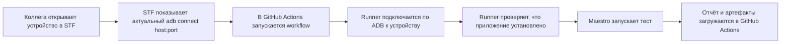

# Maestro: STF, Emulator и USB Device

Этот репозиторий запускает автотесты `Maestro` в трёх режимах:

- на реальном Android-устройстве через STF и `ADB over TCP`
- на Android-эмуляторе через `self-hosted` runner
- на реальном Android-устройстве, подключённом по USB к `self-hosted` runner

Все три сценария рабочие, но решают разные задачи:

- STF нужен, когда важен прогон на реальном устройстве
- эмулятор нужен, когда нужен более стабильный и быстрый CI без ручной работы с фермой
- USB-устройство на runner нужно, когда хочется запускать тесты на реальном телефоне без STF-прокси и сетевого `adb connect`

## Структура тестов

- [`.maestro/test.yaml`](/Users/sergejbursov/Documents/maestro-tests/.maestro/test.yaml) — основной smoke-сценарий
- [`.maestro/flows`](/Users/sergejbursov/Documents/maestro-tests/.maestro/flows) — отдельные тестовые сценарии приложения
- [`.maestro/common`](/Users/sergejbursov/Documents/maestro-tests/.maestro/common) — переиспользуемые подфлоу и общие шаги
- [`.maestro/config.yaml`](/Users/sergejbursov/Documents/maestro-tests/.maestro/config.yaml) — конфигурация discovery для вложенных flow-файлов

## Как это работает



## Какие workflow есть в проекте

- [`.github/workflows/maestro-stf.yml`](/Users/sergejbursov/Documents/maestro-tests/.github/workflows/maestro-stf.yml) — прогон на реальном устройстве через STF
- [`.github/workflows/maestro-emulator.yml`](/Users/sergejbursov/Documents/maestro-tests/.github/workflows/maestro-emulator.yml) — прогон на уже запущенном Android-эмуляторе через `self-hosted` runner
- [`.github/workflows/maestro-usb-device.yml`](/Users/sergejbursov/Documents/maestro-tests/.github/workflows/maestro-usb-device.yml) — прогон на реальном телефоне, подключённом по USB к `self-hosted` runner

## Схема запуска


## Что нужно подготовить один раз

### 1. Убедиться, что устройство доступно через STF

Нужно:

- установить тестируемое приложение на устройство через интерфейс STF
- открыть устройство в веб-интерфейсе STF
- убедиться, что телефон включён и разблокирован
- убедиться, что STF показывает команду вида `adb connect host:port`

Важно:

- приложение сейчас устанавливается вручную через STF до запуска workflow
- порт ADB может меняться после переподключения устройства
- перед каждым запуском нужно брать свежий `host:port` из STF

### 2. Добавить ADB-ключ в STF

STF должен доверять тому ADB-ключу, который будет использовать GitHub Actions.

На Mac получи публичный ключ:

```bash
adb pubkey ~/.android/adbkey
```

Дальше в STF:

- открой раздел `Ключи`
- вставь вывод команды `adb pubkey ~/.android/adbkey` в поле `Ключ`
- в поле `Устройство` укажи понятное имя, например `github-actions-maestro`
- нажми `Добавить ключ`

### 3. Добавить ключи в GitHub Secrets

В репозитории открой:

- `Settings`
- `Secrets and variables`
- `Actions`

Добавь два секрета:

- `ADB_PRIVATE_KEY` = содержимое файла `~/.android/adbkey`
- `ADB_PUBLIC_KEY` = вывод команды `adb pubkey ~/.android/adbkey`

Команды на Mac:

```bash
cat ~/.android/adbkey
adb pubkey ~/.android/adbkey
```

Важно:

- в `ADB_PRIVATE_KEY` вставляется приватный ключ целиком, многострочно
- в `ADB_PUBLIC_KEY` вставляется публичный ключ одной строкой
- если в конце строки есть `%`, это обычно символ shell, его вставлять не нужно

## Как запускать тест

Перед каждым запуском:

1. Открой устройство в STF.
2. Установи или обнови тестируемое приложение через интерфейс STF, если на устройстве неактуальная версия.
3. Разблокируй телефон.
4. Скопируй свежую команду `adb connect host:port` из STF.
5. Открой `Actions -> Maestro Tests on Real Device -> Run workflow`.
6. Укажи:

- `device_address` = актуальный `host:port` из STF
- `app_id` = `com.example.testmaestro`
- `test_path` = `.maestro/flows`

7. Нажми `Run workflow`.

## Что делает workflow

Workflow в [`.github/workflows/maestro-stf.yml`](/Users/sergejbursov/Documents/maestro-tests/.github/workflows/maestro-stf.yml):

- ставит `Maestro`
- ставит `adb`
- подхватывает ADB-ключи из GitHub Secrets
- проверяет доступность ADB endpoint
- подключается к устройству
- проверяет, что приложение установлено
- будит и разблокирует устройство
- запускает `Maestro`
- загружает артефакты в GitHub Actions

## Как запускать тесты на эмуляторе

Этот сценарий подходит, если у тебя есть машина с уже установленными:

- Android SDK / Android Studio
- `adb`
- Android-эмулятор
- `self-hosted` GitHub runner

Важно:

- GitHub-hosted runner не увидит твой локальный эмулятор
- workflow для эмулятора рассчитан на то, что эмулятор уже запущен
- приложение устанавливается на эмулятор заранее вручную или отдельным шагом

Порядок запуска:

1. Запусти эмулятор на машине, где работает `self-hosted` runner.
2. Установи или обнови тестируемое приложение на эмуляторе.
3. Убедись, что `adb devices` показывает, например, `emulator-5554`.
4. Открой `Actions -> Maestro Tests on Emulator -> Run workflow`.
5. Укажи:

- `android_serial` = `emulator-5554` или другой serial эмулятора
- `app_id` = `com.example.testmaestro`
- `test_path` = `.maestro/flows`

6. Нажми `Run workflow`.

Workflow в [`.github/workflows/maestro-emulator.yml`](/Users/sergejbursov/Documents/maestro-tests/.github/workflows/maestro-emulator.yml):

- проверяет, что на runner есть `adb`
- проверяет, что эмулятор запущен и доступен через ADB
- будит эмулятор и отключает анимации
- проверяет, что приложение установлено
- запускает `Maestro`
- загружает JUnit-отчёт и артефакты в GitHub Actions

## Как запускать тесты на USB-устройстве

Этот сценарий подходит, если у тебя:

- телефон подключён по USB к машине с `self-hosted` runner
- на телефоне включён `USB debugging`
- телефон подтверждён в `adb`

Проверка на Ubuntu:

```bash
adb devices -l
```

В выводе должно быть устройство со статусом `device`, например:

```text
R58N123456A device usb:1-1 model:SM_G950F
```

Порядок запуска:

1. Подключи телефон по USB к Ubuntu-машине с runner.
2. Разблокируй телефон и подтверди RSA-ключ, если Android попросит.
3. Установи или обнови тестируемое приложение на телефон.
4. Убедись, что `adb devices -l` видит телефон как `device`.
5. Открой `Actions -> Maestro Tests on USB Device -> Run workflow`.
6. Укажи:

- `android_serial` = serial телефона из `adb devices -l` или оставь пустым, если телефон один
- `app_id` = `com.example.testmaestro`
- `test_path` = `.maestro/flows`

7. Нажми `Run workflow`.

Workflow в [`.github/workflows/maestro-usb-device.yml`](/Users/sergejbursov/Documents/maestro-tests/.github/workflows/maestro-usb-device.yml):

- проверяет, что на runner есть `adb`
- ищет локально подключённый по USB телефон
- будит устройство и отключает анимации
- проверяет, что приложение установлено
- запускает `Maestro`
- загружает JUnit-отчёт и артефакты в GitHub Actions

Основной smoke-тест лежит в [`.maestro/test.yaml`](/Users/sergejbursov/Documents/maestro-tests/.maestro/test.yaml), а дополнительные сценарии — в [`.maestro/flows`](/Users/sergejbursov/Documents/maestro-tests/.maestro/flows).

## Если что-то пошло не так

### Ошибка `Connection refused`

Это значит, что runner достучался до сервера, но ADB endpoint не активен.

Обычно причина одна из этих:

- устройство не открыто в STF
- порт уже изменился
- устройство переподключилось
- STF больше не держит ADB endpoint активным

Что делать:

- заново открыть устройство в STF
- взять свежий `adb connect host:port`
- перезапустить workflow

### Ошибка `unauthorized`

Это значит, что ADB endpoint живой, но STF не доверяет ключу GitHub Actions.

Что делать:

- проверить, что в STF добавлен правильный публичный ключ
- проверить, что `ADB_PRIVATE_KEY` и `ADB_PUBLIC_KEY` в GitHub взяты из одной и той же пары
- лучше всего использовать:

```bash
cat ~/.android/adbkey
adb pubkey ~/.android/adbkey
```

### Workflow завис на `Run Maestro tests`

Обычно это значит, что:

- телефон снова заблокировался
- на экране появился системный pop-up
- приложение долго стартует
- `Maestro` ждёт состояние на экране

Что делать:

- посмотреть экран устройства в STF в момент запуска
- убедиться, что экран включён и телефон разблокирован
- проверить, нет ли pop-up с разрешениями

## Ограничения текущего решения

Сейчас схема полуавтоматическая:

- устройство нужно открыть вручную в STF
- телефон нужно разблокировать вручную
- актуальный ADB порт нужно брать вручную перед запуском

Если понадобится более стабильная схема без ручных действий, следующий шаг:

- поднять `self-hosted runner` на ноутбуке с STF
- запускать тесты внутри той же сети, где живёт ферма
- по возможности автоматизировать резервирование устройства
